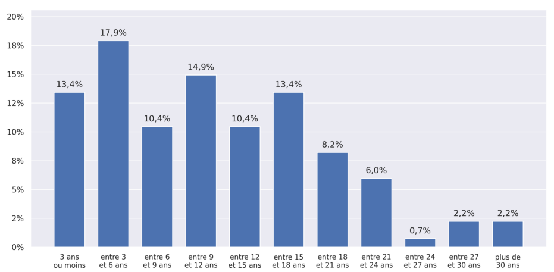
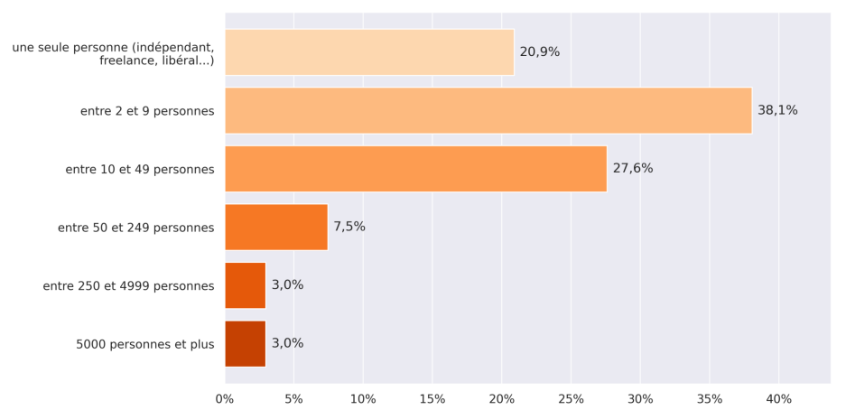
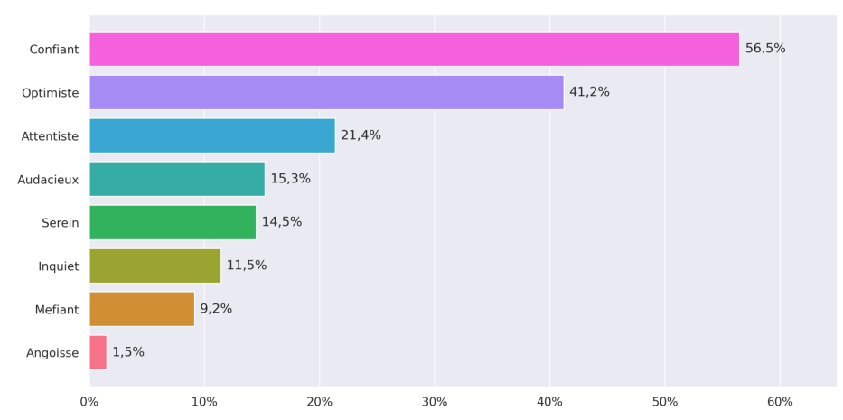
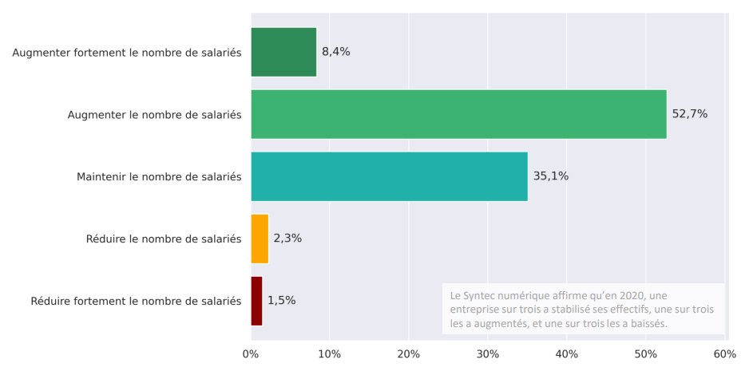

# L’impact du Covid-19 sur l’open source

  
    Groupe 1 | Julie Lazes
  

---
layout: center
---

# Intro

---
layout: center
---

# Qu'est-ce que l'open source 

---
---

# Logiciel libre ≠ Logiciel open source

  
Logiciel libre se définit par opposition au logiciel propriétaire.

  
Logiciel libre se définit par opposition au logiciel propriétaire.

---
layout: center
---

# L’influence de la pandémie sur les développeurs et leurs usages de l’open source

---
layout: intro-image-right
image: 'https://cdn.thenewstack.io/media/2019/11/eaa5e6c7-octoverse19_banner-cropped.png'
---

# Github
## Rapport octoverse

- Plateforme de collaboration pour les développeurs
- 32 millions de visiteurs par mois
- Rapport octoverse 2019/2020/2021

---
---

---
---

---
---

---
layout: image-right
image: 'https://uploads-ssl.webflow.com/5cc865a89b8ac6520edd8b16/602ff41e93153b1e67aaf68f_hero_image_compressed-p-1080.png'
---

## L'exemple d'Okarito
### une plateforme de réservation pour les voyages professionnels

- interview avec 4 développeurs
- mode de travail hybride (télétravail partiel ou total)
- pas d’outils open source de communication
- outils open source pour développer l’application (NuxtJS, Ruby on Rails, Storybook, etc)

---
---

# Etat des lieux suite à la crise du covid-19

- Des entreprises assez jeunes et à effectifs réduits

  
  

 

---
---

# Etat des lieux suite à la crise du covid-19

- Dans la majorité, les dirigeants restent confiants et pensent embaucher au cours de cette année

  
  

 

---
layout: center
---

# De nouveaux outils

---
---

# Combat contre le covid

  
  

 

---
---

# Combat contre le covid

  

    
    jitsi
  

  

    
    Big Blue Button
  

 

---
---

# Open Source et cybersécurité

- augmentation des besoins informatiques (télétravail, numérisation des échanges)
- La crise du covid a vu une multiplication des incidents de cyber-sécurité et des vols de données 

---
---

- besoins particuliers de certaines entreprises:
  - coût 
  - protection des données 

- intégrabilité et personnalisation

L’Open Source permet souvent de mieux répondre à ces besoins. 
souvent gratuit, pas de backdoors et contrôle facile du logiciel, code accessible et modifiable
EXEMPLE : les logiciels qu’utilise S. SARAZIN

---
---

# Limites de l’utilisation de l’Open- Source 

 

Risques habituels
- pas de suivi professionnel
- manque d’habitude des usagers qui ont l’habitude des logiciels mainstream
- installation et maintenance plus complexe

 

Réponse à ces risques : 

Logiciel open source distribué par entreprise (GitHub et Microsoft, RedHat et IBM, etc.)

