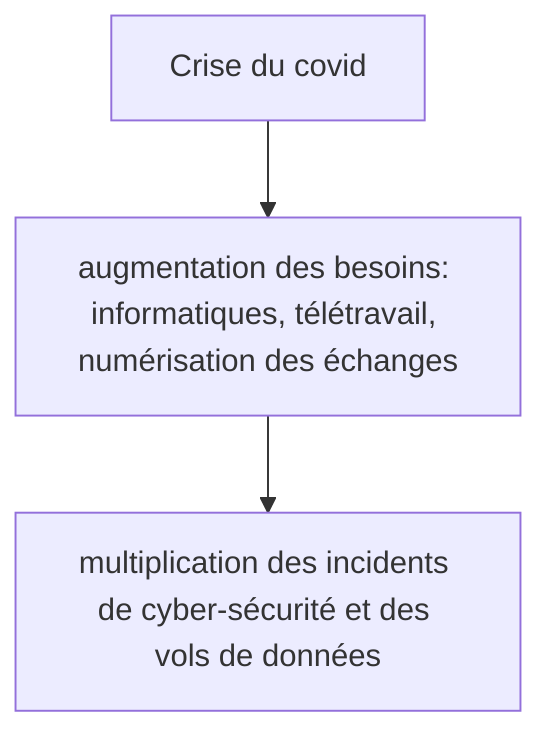

# L’impact du Covid-19 sur l’open source

  
    Groupe 1 | BERNARD Thomas,  ILLIEN Antoine, LAM Alexandre,  LAMBERT Antoine, NGUYEN William
  

---
layout: 3-images
imageLeft: 'https://raw.githubusercontent.com/alexandrelam/tranumslides/main/public/git.png'
imageTopRight: 'https://sli.dev/og-image.png'
imageBottomRight: 'https://sli.dev/screenshots/cover.png'
---

---
---

# Introduction

- Étude Teknowlogy Group (CNLL & Syntec Numérique) en 2019
	- 80% des entreprises anticipaient une augmentation de l’utilisation
	- croissance de 9% par année jusqu’en 2023 (en France)
	- croissance moyenne du marché IT (global) : 4%
  
 
 

# Problématique 

- Est-ce que les prédictions sur la croissance de l’open source faites en 2019 sont vérifiées aujourd'hui ? 
- Quels sont les impacts du Covid-19 sur la manière dont les développeurs travaillent ? sur les outils utilisés ? sur la protection des données concernant la possible utilisation de l’open source ?

---
layout: center
---

# Qu'est-ce que l'open source ? 

---
---

# Logiciel libre ≠ Logiciel open source

  
Logiciel libre se définit par opposition au logiciel propriétaire.

  
Logiciel open source se définit comme une version business du logiciel libre.

---
layout: center
---

# L’influence de la pandémie sur les développeurs et leurs usages de l’open source

---
layout: intro-image-right
image: 'https://cdn.thenewstack.io/media/2019/11/eaa5e6c7-octoverse19_banner-cropped.png'
---

# Github
## Rapport octoverse

- Plateforme de collaboration pour les développeurs
- 32 millions de visiteurs par mois
- Rapport octoverse 2019/2020/2021

---
---

---
---

---
---

---
layout: image-right
image: 'https://uploads-ssl.webflow.com/5cc865a89b8ac6520edd8b16/602ff41e93153b1e67aaf68f_hero_image_compressed-p-1080.png'
---

## L'exemple d'Okarito
### une plateforme de réservation pour les voyages professionnels

- interview avec 4 développeurs
- mode de travail hybride (télétravail partiel ou total)
- pas d’outils open source de communication
- outils open source pour développer l’application (NuxtJS, Ruby on Rails, Storybook, etc)

---
---

# État des lieux des entreprises suite à la pandémie

- Des entreprises assez jeunes et à effectifs réduits

  
  

 

---
---

# État des lieux des entreprises suite à la pandémie

- Dans la majorité, les dirigeants restent confiants et pensent embaucher au cours de cette année

  
  

 

---
layout: center
---

# De nouveaux outils

---
---

# Combat contre le covid

  
  

 

---
---

# Combat contre le covid

  

    
    Jitsi
  

  

    
    Big Blue Button
  

 

---
---

# Open source et cybersécurité

  

    <strong>+100%</strong> d’incidents cyber pendant la crise
  

  

    <strong>20%</strong> des entreprises ont vécu un incident cyber lié au télétravail
  

  

  <strong>+600%</strong> d’attaques par phishing
  

---
---

# Avantages de l’open source

  
Coût

  
Protection des données

  
Personnalisation

  
Souvent gratuit ou moins cher que les solutions propriétaires

  
Développé avec la protection des données en objectif (pas de backdoors, pas de collecte des données)

  
L’accès au code source permet une intégration plus facile avec des solutions déjà utilisées

---
---

# Limites de l’open source

 

- pas de suivi professionnel
- manque d’habitude des usagers qui ont l’habitude des logiciels mainstream
- installation et maintenance parfois plus complexe

 

<ins>Réponse à ces risques :</ins>

Logiciel open source distribué par entreprise (GitHub et Microsoft, RedHat et IBM, etc.)

<img class="h-20" src="data:image/png;base64,iVBORw0KGgoAAAANSUhEUgAAAOEAAADhCAMAAAAJbSJIAAAAflBMVEX///8AAACPj4/V1dX8/Pzz8/Pn5+fu7u7e3t739/c1NTXr6+v29vbx8fGlpaWwsLCYmJhRUVEfHx+CgoIlJSV6enrNzc07Ozu8vLxERER0dHRJSUlhYWHGxsZYWFgaGhpqamouLi6dnZ0LCwuQkJB/f3+tra0UFBQjIyNlZWWz/V0sAAALM0lEQVR4nO1da3eqOhDVgqhYBcUH9vgA7ev8/z94L6VWwITsCQmTrnX250KzJZn3TAaDf/gHFKNxMJl43tbzJpNgPOJejjkEx2iRHHbn67CO63l3SBbRMeBeoD6egzTehEM1wk2cBs/cyyVi5r0ezgC5O86HV2/GvWwUx2Tf3JIYrvvkyL14JUbRQYvcHYfIYSEUXJYd6ZVYXpwUP9P0ZIReiVM65SbUgLfRO3pyXDceN6k7ptGHYXolPiI3PuQ4pukFCs7xmJveIEis0SuR8EqdWWaZX4GMzxIY2/5+NyQ8e3Ua98SvQMwgc95XPRIcDlfvPfPzEKfBLMI+9eNzXwewjqQ3FytdsxAcDtdpL/zmXb2HLjjM7RNMGfkVsP0Z/Q0zweFw49skOOlfhD4inNgjeOEm942LJX5TThFTx8HKTg123Lwq2FnwOLbcpBrYmia44Gb0gIVZgvxK4hFvJgn+5WYjxF9zBM2EQc1jaYjfaM/NRIq9kfj42CUt0cTOQHxj3q8vT8VnZ2dj5DbB/yl23Kgjl7doiV0nir6rUrSKZRcj9TcQ7KQ03FT0j9BW/TwRNR0kegQj7nUTEOkQ9LhXTYJGuHjMvWYiyMaN764xKsaeqjNeuFdMxguN4G+SMjeQpE2gfN3ZTnGCFNdPtYFMiU6pDmEUzMdBECX9WK1ZvJ2NR/NAlZLd4wSfFK/Kf0717JIboiFDdq8dmqv+9gkleFS9qWZCTBJ71SbhoiYhlXURYOHfs3LFDfX6HNlRLYdmTFSZ9zpjOVRl5DB/fGZrvuzk6VFwjJS//QYhqLbWhK+Zm7XTX4UKXF0ciFhv6gSaJElpsLzmTRJ9eVc+GaoJAhk0afAnMBMaz6QJwon6YWXmTa3rh6uWx8Up1PUpiRfpcetNZqPRaDbxtsd0EScnYcVDa1WJenVKvQ/ELdoNwOoeuOaHS9qesZ2kl0NerU1t/wZAla4ipqFUhUNl0icoYx9hFnloLHPuRVn58Q+KL4BUmrUrRSRPr1Sr6W4TBVRnxg+izU5ZaIFUgrQKG8il4CxqBURNq5MxhYqdrFZ7KPCMLHAtXyGW6OVk6EMrlEoK6Adq+4Xsw4fc0qvMPFU5TSV2vVJqIofW+Cp+GNsBiF1kDz5YFil+Giy3EHgW/cEHk33ik/iJPcx7DkFvey16GA6vuS9Lh2L/B/bTObvnRugi/zw+i1ikJTg7rvBkymNVGJ4r1MrzGAIeqc6ajyojdXdoJuuMgBBGaB4mQmWeUE71BEKXQFNhUBoM+LoCp4RVNvQ2KR3aT9eDCKRGgbpEJIWQTkz8oCDGHbXqTHWYuwauhsAZaZWrqoeBK8NfxLCmEmlxTj6VT6ueqMTm/ZzyIJ+gIeam70lALL5zg8S77AmYl/6Ne6iW0u8qMGl7BSWRF/88Relm4h5ZAaQdfvATjqCIqL7bcR9B6fy4CX2CpcAapPlGji/3JhQJusKFaRyE/qSbvsCt7oyR2B14Rv3bDSIcQ4u9jQQQlFt5EHGTjc/krgM3wMs8Ga5EjXfEaQI/iWUNEVyu7oIgLQEr8K+E8AgWNIY7/joA1onrIlqDGwn8835uwAuYCxMM3tTcFmkVf9BFF6ID/uK2esR1APfNFyfrDf1jN5RhCVglFsEaVLmcXZr2p67h+8YJz1c5o+5LwN/Fx4OscAFuL4DNlClulXKGZx4Be3wzXFm44DjdAUfdtviP4ZIoJQjTFChKLbFyY0rjDXCU/h3Wne6Y3SVycN0XWOG7xhB1L95gxcJbCvUItF3nBNuwLtndBfB1ozFkU1M2TAH12/fwfv6t3zAc5PBv4RbQvZcP0LkXv1XSrAZop+Rv1RYfA3QON2vRpQA5uO4r0oXyBc46IRHgCCG8Sz/cibQVGMPrhiXNb/UtVoMc/dNf6h/msNR1JmlRAnbcd3jmnz+/XQXq1v5vi8F5Gc6y0kfAkajTAB5KanCGnwHAJc1/8ZRx6FIYw4fFxwuhrtglhYgnnxLCbGCX1AVewrcg1MK5kyCllA1FhDqFjJtWBXjByZFSJ8ZNqwJ80QGl/N2dg0iopJ0OpvhFTe4kgfFjePXxcIBLgQy8yLRYM2E4Indt6Q2EOrXCEoPz+O5sU0KJaZHHJxSHu7JNCZXQRaMdpYzdDWlKWXERmYAjHkPDY9C1QajXL6NLcH3RkLdD9gZsMEKJMhdBGZEYK/57H6DcI1LO0iH1oTCzK0C5S7Ls6CXdXMHvYMARmgJl+AzuAP8C90kkWJn31ZLmO3IHpEiNTzcFTrsCiDf2TWpC+zHCaF19vKlSimqrWCikp1j3KWmPViQ/cWgwX3yfeGHRfbIccWrwlesoTojXKt/nW1Bnd695VMaYetdGJcJLO79M8W+8MeQb1QIZ8rWwYf8B8IB8c2bViKZpmQJ53xENjz5euyYuqNt0CE8lNgSNqzPrdWo6M9h7bFvXujqzPimIMhblB8u+dqqnNWu6IQ31Zjn34xATooEVZI23EGd/3PBp/zTqXl77YHnpDlZf2rXhjrqj+x+nHb9qvkkwOt0cUg0Z/41HOSiOlO/eJ2N/dly0V2yEdvppOl3fLpihIzrPn/cfYJG3vvDJtDXu6cmXG0QunsiuOVckrq8w7ZYXYyR977XrXQRCRSZKQtV+ipkqTRW+RN3j/t57lnekJyv+ERqn9ROGSO4/cTrWG4/pz9InQ7eeSLaTUJzUbR/UwM+zZHGETR5/crwkB7LvIIesdUIcI6jbLfMc/z94utH0DW9S/SXWPmHNbsH9UErEihhhUkDeGyILK9aSamiKmXbDlNFbzVvEnSzoVrvLHAt4rWmBDnKIogVtv630+9QauSFnjWrm6BrYArSOBJRap1UFgwzVpjeCGbsRVOGZS6MhVZEKuFp0+8bUfYsfiv8jD2dUj6/SX9bpsKFMjWuBcsyx1CAMK9JGOXVYJ5FKSn1KoU4cyTfLG/RXJXTukiYMa24BYBjLXYiqpdBelqRX9W5C1kCRI+l5qJVEtVohejM0DBg2WA+hPABe03Ft69GLT2lGw6oARbg0613/hVo2ql4glTLWUgzY1pfGf+qGipdL/uxTzz98lr0PBd6NLd2nDUvFF3/tV91Jyl1DFwQzQ7oBm7J4FDeMoFXSIUZMGtf9CJISlhkt2eOfbuPTnzDc/1meNu+4Wy9Et0uIBWtrgbSvSJzf9s3cW9LpcsEdcQ0yuWa1ELpTMIO8fWTKyWaRQheVr3H8JdYbdJepJjow1MrzSUInFnNN+gwPWv9vmovfZi/zq80w16x+kVTofOq4RhB0Ga60a18kAnVtq+pLl2GHXSVzdC3N39Nk2CkbJNMZmZWyLz2GHUsJpGHMC3bJNwlaDDvvJ6kR/mk87avF0EDzQIujG74J7zOe6FLXYGikO0JVEbZMLoso3XrbY3EXdZbrjzqlMzR0Bxw5paBb8UZmaEymU0NEfX1DgwYkMafQE0Oj3ZATUlFYLwxXhu3jOSVKpNuRQWG4N++oEkIMPTC00s2K54bsM7R0UyhcTG6b4Ye1jusxmB3S3UIgw6XNVghsDXYZWh4O7yG5aN1oFcIwtD4TwAeWYZHhUx93ZnvKK8qtMVz3NdRBVb5LK/i6Q8Wwx95Or12o2mG47HcqR5r3zDDv/fYJv8X3zzTf2cJw0YeEaWIqPY6Z5hulDN+4JhpOJCnNTPN9EoYvnCMAAuGidMdkCisjn7inUz0LsnC6VpvAe4mdmLj53rTkdMVeM1gSujP3dls7kGdtuVerHnhxa3LxKLobAfqa+V7Is4wsZA26Ioi/wlX7LpIv+CrHOsdct7crEXhe17XNPI9beP6Da/gPfNWsZr34KLUAAAAASUVORK5CYII="/>

<img class="h-20" src="data:image/png;base64,iVBORw0KGgoAAAANSUhEUgAAARgAAAC0CAMAAAB4+cOfAAABHVBMVEX///8AAADuAADm5uZAQEDIyMh+fn75+fm2trbv7+/xAAD1AABPT0+6urrR0dGOjo5WVlYaGhrW1tbr6+vNzc395eW+vr44ODjg4OCamppra2uxsbEvLy96enr4r6/+7e0ACgr2lpb819f0dXX3np4lJSUxMTFhYWEXFxenp6f4p6f709PzbGz6xMTvFBTyV1fvIyNTJCTzZmaTk5P1i4vwLy/xR0f0gYHzaGj6wMDyW1t2GBgAERHNGBiLDQ29GBh1CAjyT0/wOjq/bGygGxvhFxc2EhJfHR16FBQrHh5RGhonDQ1GIyNoFxfHHByZGxsfEBDbAAAmNjaQAACuGBhSDQ1oDAyKHBy9BgY2Dw+ZFBRcFBTMDAy1ISGiIyPyN/eEAAAMSUlEQVR4nO1daWPauhKN2RzbJCwpBAgBQkMITUrSkqVtmm6vtOl+73vpetP7/3/Gsw02Gi2WbIvYuJyPWEiaw2g0i2RWVuKDyr2d1kE76llECbVSUckPD1M2jk8OIphSHNB6Zcn/sgU/bZ+mXAwP70cztSihnrni7yDLpjJMAQzPu9HNMQqox6j4Jw4191MkTncqkU71dvESk/5o96Ddvv+Ewov99HHU870ttBgMsLHzZ2xTvnkx8egPsDa7QYhJpc4Sv6JO+STQcdzid77AOAjKS9KpuRuCGHP7TqzXp4bixcRhQneox2GJSaWSaYUfhicmtRO1EHNAWwIviWTGv9dLRfJM8BlfaBEcRy2HbMhZSankGeCA4QCJl1FLIhmBwwECyfJmKtJ4SZj53ZFHzEnUskjFMV9gUbyKWhaZ6MrjJVlG5kQmMUkqPA354opjN2pp5CFMiorEUdTiyEO4FBWBqMWRB6krKZVKTN2gK5eXVGLyv//R5RJzN2qBJGHjhSGXmKQYmboi2cYkxcUrKa8lq0wycjJZRemM5VqZ86hlkoKioihv5C6ms6hlCoHKQevk8MwKqhULb+UupqilC4b2/Z0jVwT9uU2MciGVmQWMI9UWPDVlXE2IUa5kmpmFKy91iajIeDslRrkYyqPmSdSC+kP7kBTBeOcQo7yXyEzUovoCtWpvPHWJUT6MpRmaRYoj6flu4+OMGKXzWxYzCxRHMuoArvGd4JOk5fQoanGFQTvDbMHZrl2l+SxFaU6jllcUKtO1HT6FzJi7kwxqtKglFgS7NG18wYhROtd6+PW0FrXEgvAoqA3/wplR3l8aYanJRS2xGLoeIhjPCWJMIzwORY3+93+jFlkMnoc89AsKM52LMNSYJn0japmFcO4pxvANhZlQ1BjflGrUMgvB+0SmPsZ3JmdBXRqBdih9rCj/u7sICU7WjSNXkA6dGeXN9TCA2hhf7QzPApyIpkSPgswonatL3Sc3xjPze39ZntM5ees0XuCeZrCUn4kP3y996I2uP7MJtfPIw5jnxfmHePUx1QK7S+r756EhQo5u3HydfOXzpPWTWK8ngSN2+vCTFzOK8vTrl89D3Zsdwxi7e/8Xx27HWmlEjpIZr72ZsdbH+4vry5TFDhE1WB8eX/8zs1Wz+macT+UJHZkyLsnogIaP375f/7g8NteWi+Hpj9ff3oFWV7OdPsaZTrGD37p+xeCCoUCldx8fPHjw8R1tT3uGuECn8d2deBu2qzSeNtgPQDYwvsyInnDWh1+YLo0/3AArFN9Drt7hEqo04wsZ1PzErHNs7xiwc3iE0hg3/4Qn5hqPsmJb6WdlfanUXHKcGr7CkL3G1p8RXkw2NWNalkYY1IMlsfWBfV1i043hr/3AxDynpSsOoyaACZ9XKQz9eTBj0/lBT+PEtj7Z9ns+yFxRv3765uXn34z0Vnw9YP/3tXQjNf713s/+3fnFrr7E9yVFQW6y6YY+vr54I0ZO5ztLXSzE+NxMNwAzVhBlKs711QcOOZ23nExonC8f4y8o80OOMb75/ey9Qqfn4/fPY27uPL5ryXSBw1yY1a0cw/HNj9//vnjx6a0ZWT94++nixYt/n9+IJfhi6+TZCH0LR9d1A0K02h1jI2PhXlhmAiO2AdMUB7JvD4jiYdSS86AKJq7+OGKkvGAoAOK+lCy08fdH3gZibnyniMAGL8hpzraM91L5QmzjaxwHEl/qIIKo5fUBaW/UEcECbEoztCVfR/dCvCMCApXbMjXD2JbdWOge8aWSgEV8HcbBbXg1C6cwNrqcg3rhcS9qEYOi4qfy5B+xLdIKQN2ZY9gd23qbGB7Py9gs4M1aDOSNUhlIxOvx1MkfoCx5oaCyI+8lk6kFCh5F0JVmiR8upgPjge6JDL1ZsAhJEO3Wo3C0LGIcIIrubtBYaphkWmyo3XtPfCe1HiZmL+Kg8vjkTNQgHx+2EmdyPaFWHu8evvKkZ/jqvBXn6v1c0a4ctHZP7h6hFA1fHZ3vtLp/LCcUqH/WqlliiSWWWGKJJZZYYoklllhiiSWWWGKJJRYAanprez3qScQNWnVUtK6lZ6OeCA41zYY25wz0+qDRcy48ksSAmdHfHwmahH6PLZR21fva6majng47IHMi6EAkMXfQxxlqD1tok+0wc0lXc3kFSLrmTYxNzmqYIdngELOOPs5TewC/atD32GrZUX/Sg19iTGwFHNQTcSBGbSA9BCBGyc/hTdRxIEZDewhCDPYtKUgIMUotyMBeSAoxiuzNOzHEFIOM7IHEECP7ZdTJIaYZZGg2FoiYTgkB5cVacgOaBSIG61vb6ikAjSBjMxE7YkBA5kWMiW1ATImQzQwx9nql3l6+UOW7gFq13ijm843cVs3e4eZLjFbbGvXzm81eby9TzA3KcOLrNspZtIdqed2BxiPG/i/DGaCXl22Ah3nPmCpdaCJt9xvZuRJTrmcUDKUCMvsy/hTDKiSGEqDWQHt0X1rbJLorMWOqWoNo3FtFrZhMYrLbJbq4fXex8IhZ42rMCvo7KwP34408tcMMPXIocOYhkRjNcyznP3YkENNHG9SdT6vcoRGUGT8gClnEjDjjjAIRQ8v1AGIcjfEafoD3IOQqySIGLn0K6kGIoWkM2LGnNsR7ZWCGZsuzsQNpS6mvcFCWQwxIMCqTXP6A0+s6uwMmOMTQ4zSwoKeT56rMphRi1D3QXiNmTAUSh2vcxhNwiNnP0AA2Bmfy0MFgDBWWGA16A5OUNN+UIraKvnnRZ+tBjACcyfNktv33UMSkszmsuW1XMQNTWK/ValnoIc+SWqSByTQK20UyDpNHzOy3aObqpjNbreM6JEQMp3wCoRJro+DqFlANN6jCGMg48tdw+y2RmMkXc9nZgk5DvUWiAxCvgaDGDzF1QmHQDQio1wZVYe6ssNrLJMZUmcYdrDPADDJrdnTtg5hJOgb9pAAGRzfKqScITFQTCzPB0DKJoRQlAQEjycTY30PD0R57cHtPxLZOosyKPpRJDA15eksZxEwCSHQB4CFjHXlmszAgv4/ATz5GAN7EFOgtJRAzlQtdHLkCxDbeHF1cm8Rcb5WYEb1laGL2HW9WdJq2kUEdMDIjMVdi0qu5fn6zt9/MFPu51RrQZonEuF1tiE6zgUtO5iP8nHbwM0dzloUe/rRHbxmOmOLMynPdSgcZfFRC8PkRg/ul7JYhidmfuUrC+m3tWEC9whFDDyKpGTz+FP0Tk687gC7+zF8RJqZ0G8QA/3EqLjuFhrf0QQzyDRC4zlwQblDvYB8flXS65kKMyAT9E4NExTDt5sY+QBgvWMSAOJxyyE7xfByMGKI4QEEojVmBNQA37gLCewxewmdJFuvmQQyoE1lTpOVIwhEDh3BTi33QXGXDagwCTiIimAcxaJWmOaiZ61fV0uVBIUO09EUMSIZDpXQmPmD2RAEgt38LxKiIggAVpSVBgxIDNyAnYAQ7Denme4iOBrXzIgaRcx+0ZOXjADEgV+1R/oXZHcelB4qEJe838NIJrD9iTjvwTuUQg/xs0KYJEQNm70EM5uVOP4V+wh56Mi9LRHJYF5uz30TFUnjSNQauXCFieuhhOq8DAzBX6lQhsZL19nTD0qp2c2zzwas8zVF2Q9PWt4jqj3RixA51wERts6qpqqbVthqqJzHY7z110Qjnt1RsNIpumSUPzjCm8cYsSNqVkOW5N7OlWmGfaDkFLA+58CYG+72dp5wKfQ/4uLxasgNJxIAZN9bu1GrZtRzu9KFiMgqXqseutEL4185PwPMuwYlgEVdUkUaMQKQEiWFUVTkag+0qjj1TeSU3VEpuY/IrIYhZIRIxFKBiMiqlPGIwE+FsKhpveNTwqU1OYxuyiBFRGSAm3TDwiMFyPu6tIdVzgfQwj1ikTCst7cDLUhFiUjWaSwymabNTQR4WmOyFYYG9j5oFJGaFPNTmPUFqtpZLDEYAcmyzxtCDfJnshNp4r4x+KI8YkPd20OvTWk6Zoai/yuh7Bkxl6sijLOXARZF1G3Yda2ydY0RdRYnEUH6GEatKMO2HWE7qSnVvdtxks4B/w0R9Ez2RAsPGjQEgO+N5f3Jj4Cp5KWfz0J/1u0cSWm4iw9IvPDInXxsh20Nj1fQ5BzMxNvFo1sQdpK6QKazKuIJUy27VR/XBWlnkppdWtjCH23K0obKrg0G1TL9/S0O6Vi7X0lPH/f+CoCBWjQO2CQAAAABJRU5ErkJggg=="/>

---
---

# Conclusion

- Croissance de l’utilisation de l’open source d’année en année
- De plus en plus d’entreprises ont un avis favorable concernant l’open source
- COVID-19 : 
	* Explosion de Github
	* Apparition (ou popularisation) de nouveaux outils open source

- Cybersécurité et protection des données :
	* Inconvénients (utilisation de réseaux moins sécurisés, partage de login par mail...)
	* MAIS aussi des avantages (absence de fonction cachées dans le code…)
  
